# Вокруг PHP – экосистема веб-приложений

## ДЗ 1. Консольный PHP
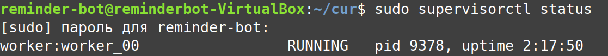

## ДЗ 2. Backend API
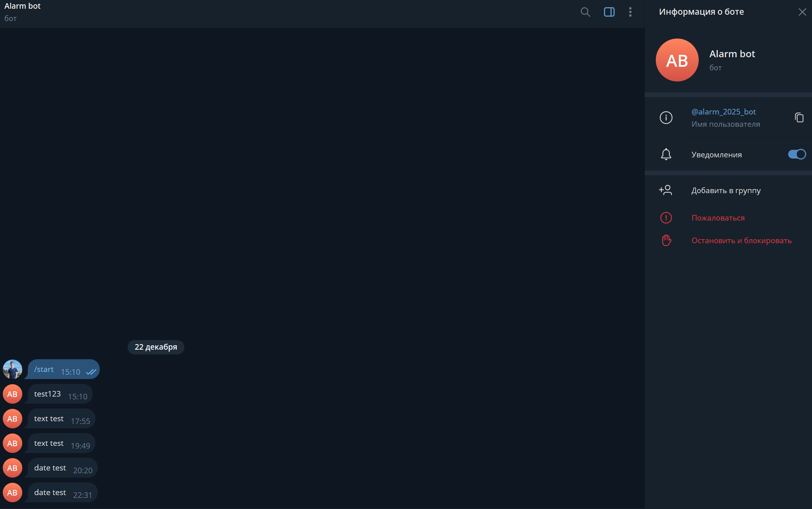

## ДЗ 3. Тестирование приложений
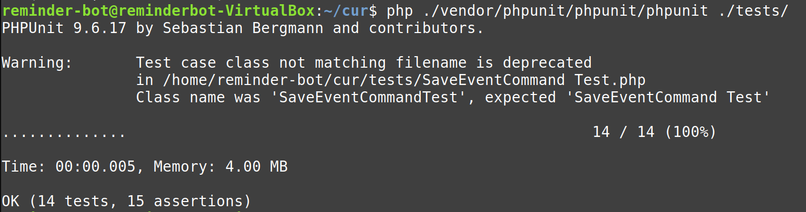
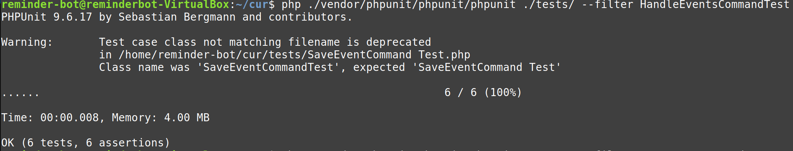
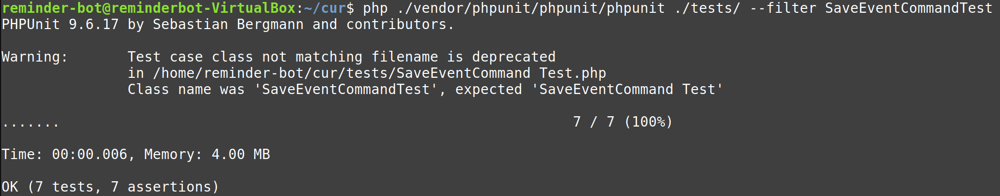
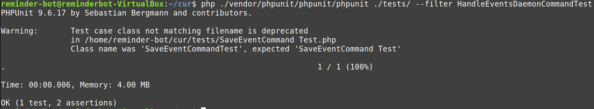

## ДЗ 4. Продвинутое unit-тестирование
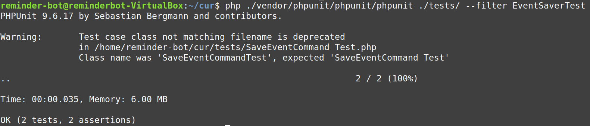
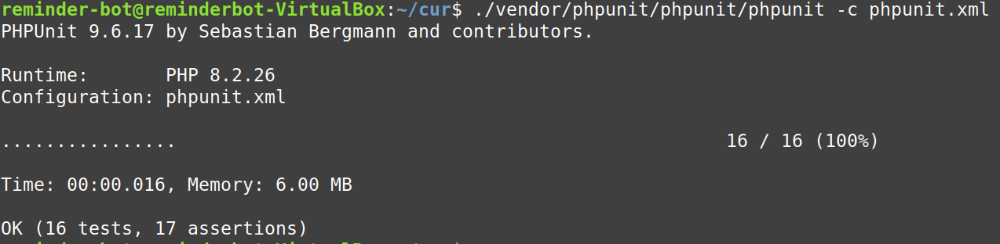
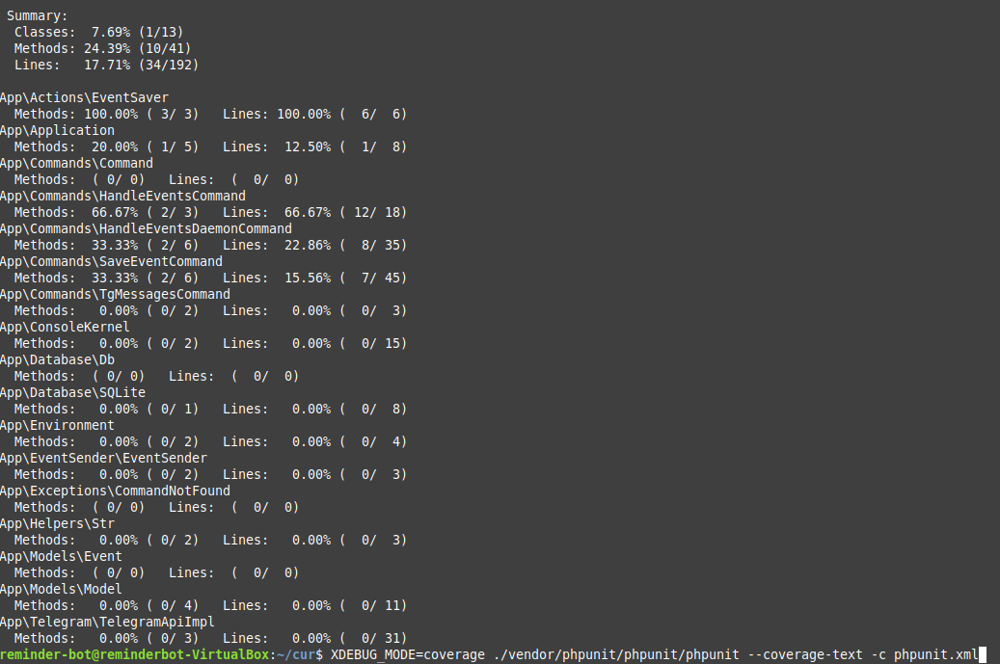

## ДЗ 5. Кэширование в PHP
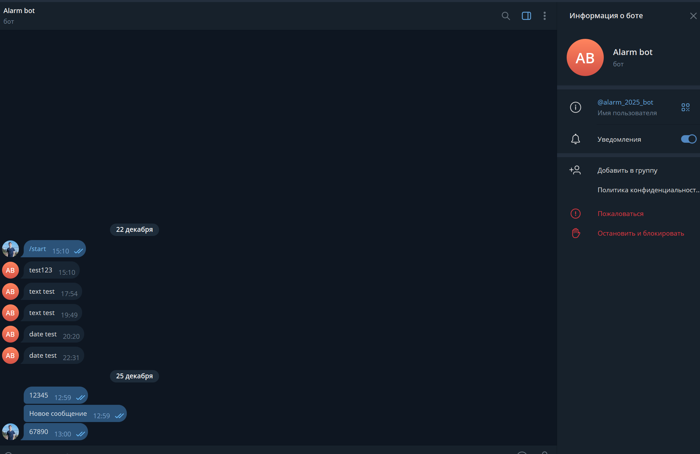
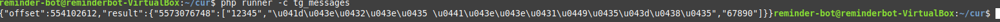
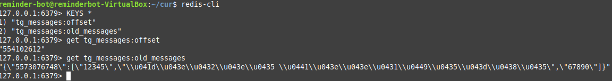

## ДЗ 6. Очереди в PHP
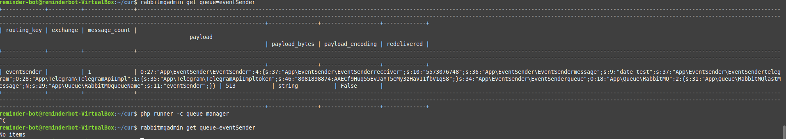
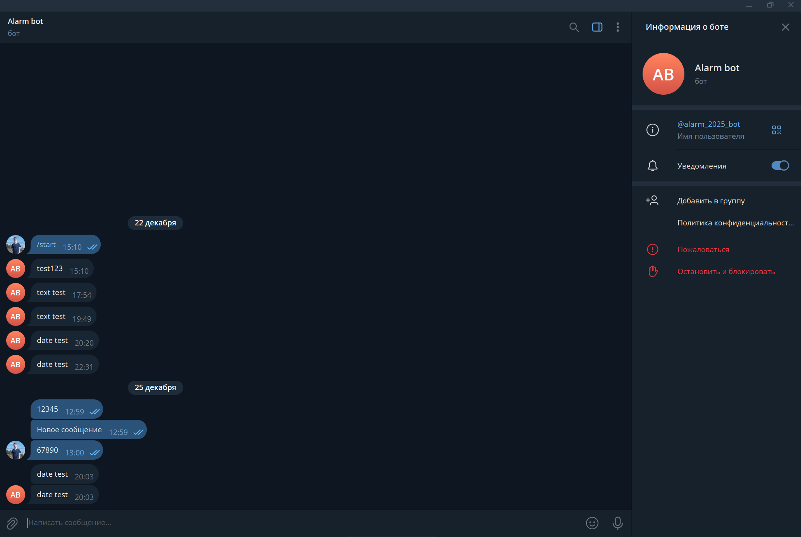

## Команды
```
sudo apt update
sudo apt install composer
sudo apt install sqlite3
sudo apt-get install php8.2-xml
sudo apt install curl
sudo apt install php-curl

Для ДЗ 4:
sudo apt install php8.2-xdebug

Для ДЗ 5:
sudo apt install redis-server
composer require psr/simple-cache
composer require predis/predis

Для ДЗ 6:
sudo apt install rabbitmq-server
sudo rabbitmq-plugins enable rabbitmq_management
composer require php-amqplib/php-amqplib
```

Для настройки общей папки в виртуалке:
```
sudo usermod -aG vboxsf user
```

Создать конфиг в папке:
>/etc/supervisor/conf.d

```
[program:worker]
process_name=%(program_name)s_%(process_num)02d
command=php8.2 /home/reminder-bot/cur/runner -c handle_events_daemon
autostart=true
autorestart=true
user=reminder-bot
numprocs=1
redirect_stderr=true
stdout_logfile=/var/log/worker
```
